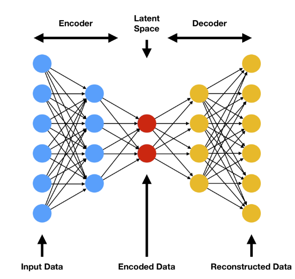

## Charting Multi-Scale Brain Phenotypes Using
# **Spectral Normative Models**

Presentation slides for the [ISMRM Workshop on 40 Years of Diffusion](https://www.ismrm.org/workshops/2025/Diffusion40/)

  <a href="https://sina-mansour.github.io/" target="_blank" class="slidev-icon-btn">
    <carbon:user-avatar-filled />
  </a>
  <a href="https://github.com/sina-mansour" target="_blank" class="slidev-icon-btn">
    <carbon:logo-github />
  </a>

  
  

    
Sina Mansour L.

    
National University of Singapore & The University of Melbourne

    
<carbon:email /> sina.mansour.lakouraj@gmail.com

  

  <carbon:calendar /> Feb. 19. 2025

---
layout: section
transition: fade-out
---

# Declaration of Financial Interests or Relationships

Speaker Name: Sina Mansour L.

I have no financial interests or relationships to disclose with regard to the subject matter of this presentation. {.text-left .text-2xl}

---
layout: default
transition: slow-fade
---

# Overview

<ul class="text-6" v-click="1" v-motion:initial="{ x: -20 }":enter="{ x: -20 }">
  <li class="flex gap-2">
    
<carbon:direction-straight-right />

    
Big data in brain imaging, and the importance of dimensionality reduction

  </li>
  <li class="flex gap-2">
    
<carbon:direction-straight-right />

    
 A primer on Graph Signal Processing (GSP)

  </li>
  <li class="flex gap-2">
    
<carbon:direction-straight-right />

    
Diffusion MRI and brain connectivity eigenmodes

  </li>
  <li class="flex gap-2">
    
<carbon:direction-straight-right />

    
Leveraging eigenmodes for Spectral Normative Modeling (SNM)

  </li>
  <li class="flex gap-2">
    
<carbon:direction-straight-right />

    
Empirical application: personalized brain charting of Alzheimer’s Disease

  </li>
  <li class="flex gap-2">
    
<carbon:direction-straight-right />

    
Concluding remarks and future directions

  </li>
</ul>

  
<carbon:chat /> {{ $slidev.configs.title }} 

---
layout: default
transition: slow-fade
---

# Big data in brain imaging

<ul class="text-6" v-click="1" v-motion:initial="{ x: -20 }":enter="{ x: -20 }">
  <li class="flex gap-2" v-click="1" v-motion :initial="{ x: -50 }" :enter="{ x: 0 }" :leave="{ x: -50 }">
    
<carbon:direction-straight-right />

    
Brain scans are inherently large files

  </li>
  <li class="flex gap-2" v-click="2" v-motion :initial="{ x: -50 }" :enter="{ x: 0 }" :leave="{ x: -50 }">
    
<carbon:direction-straight-right />

    
Sample sizes are limited relative to exemplary AI models

  </li>
  <li class="flex gap-2 text-rose-600" v-click="7" v-motion :initial="{ x: -50 }" :enter="{ x: 0 }" :leave="{ x: -50 }">
    
<carbon:direction-straight-right />

    
Importance of dimensionality reduction for AI in neuroimaging

  </li>
</ul>

  <table>
    <thead>
      <tr>
        <th>Example</th>
        <th v-click="4" v-motion :initial="{ x: -50 }" :enter="{ x: 0 }" :leave="{ x: -50 }">

</th>
        <th v-click="5" v-motion :initial="{ x: -50 }" :enter="{ x: 0 }" :leave="{ x: -50 }">

</th>
        <th v-click="6" v-motion :initial="{ x: -50 }" :enter="{ x: 0 }" :leave="{ x: -50 }">

</th>
      </tr>
    </thead>
    <tbody>
      <tr>
        <td>Total data</td>
        <td class="text-center" v-click="4" v-motion :initial="{ x: -50 }" :enter="{ x: 0 }" :leave="{ x: -50 }">45 terabytes</td>
        <td class="text-center" v-click="5" v-motion :initial="{ x: -50 }" :enter="{ x: 0 }" :leave="{ x: -50 }">400 terabytes</td>
        <td class="text-center" v-click="6" v-motion :initial="{ x: -50 }" :enter="{ x: 0 }" :leave="{ x: -50 }">90 terabytes</td>
      </tr>
      <tr>
        <td>Tokens (sample size)</td>
        <td class="text-center" v-click="4" v-motion :initial="{ x: -50 }" :enter="{ x: 0 }" :leave="{ x: -50 }">~15 trillion</td>
        <td class="text-center" v-click="5" v-motion :initial="{ x: -50 }" :enter="{ x: 0 }" :leave="{ x: -50 }">~2 billion</td>
        <td class="text-center" v-click="6" v-motion :initial="{ x: -50 }" :enter="{ x: 0 }" :leave="{ x: -50 }">~45 thousand</td>
      </tr>
      <tr>
        <td>Single token size</td>
        <td class="text-center" v-click="4" v-motion :initial="{ x: -50 }" :enter="{ x: 0 }" :leave="{ x: -50 }">~3 bytes</td>
        <td class="text-center" v-click="5" v-motion :initial="{ x: -50 }" :enter="{ x: 0 }" :leave="{ x: -50 }">~200 kilobytes</td>
        <td class="text-center" v-click="6" v-motion :initial="{ x: -50 }" :enter="{ x: 0 }" :leave="{ x: -50 }">~2 gigabytes</td>
      </tr>
    </tbody>
  </table>

  
<carbon:chat /> {{ $slidev.configs.title }} 

---
layout: default
transition: slow-fade
---

# Graph Signal Processing (GSP)

<ul class="text-6" v-click="1" v-motion:initial="{ x: -20 }":enter="{ x: -20 }">
  <li class="flex gap-2" v-click="1" v-motion :initial="{ x: -50 }" :enter="{ x: 0 }" :leave="{ x: -50 }">
    
<carbon:direction-straight-right />

    
A field of signal processing dedicated to analyzing signals on graphs

  </li>
  <li class="flex gap-2" v-click="4" v-motion :initial="{ x: -50 }" :enter="{ x: 0 }" :leave="{ x: -50 }">
    
<carbon:direction-straight-right />

    
Generalization of discrete signal processing ideas to the realm of networks

  </li>
</ul>

  

    
Discrete-time signal

    

  

  

    
Graph Signal: Vector of values over the nodes

    

    
Shuman et al. (2013)

  

  

    
Discrete Fourier Transform

    

    

<!-- freq circ -->
    
Frequency domain

    

<!-- time circ -->
    
Time domain

  

  

    

  

  

    
Inverse Discrete Fourier Transform

    

    

<!-- freq circ -->
    
Time domain

    

<!-- time circ -->
    
Frequency domain

  

  

    

  

  
<carbon:chat /> {{ $slidev.configs.title }} 

---
layout: default
transition: slow-fade
---

# Graph Fourier Transform (GFT)

<ul class="text-6" v-click="1" v-motion:initial="{ x: -20 }":enter="{ x: -20 }">
  <li class="flex gap-2" v-click="1" v-motion :initial="{ x: -50 }" :enter="{ x: 0 }" :leave="{ x: -50 }">
    
<carbon:direction-straight-right />

    
Analogous to DFT, but for graphs

  </li>
  <li class="flex gap-2" v-click="2" v-motion :initial="{ x: -50 }" :enter="{ x: 0 }" :leave="{ x: -50 }">
    
<carbon:direction-straight-right />

    
GFT is defined using a graph shift operator

  </li>
  <li class="flex gap-2" v-click="3" v-motion :initial="{ x: -50 }" :enter="{ x: 0 }" :leave="{ x: -50 }">
    
<carbon:direction-straight-right />

    
Graph Fourier basis via singular value decomposition of shift operator

  </li>
</ul>

    

    

      
Lower graph frequency

      
Higher graph frequency

    

    
Shift Operator: symmetric normalized Laplacian

    

    

    
Graph Fourier Transform

    

    
Huang et al. (2018)

    

<!-- gs circ -->
    
Graph signal domain

    

<!-- gf circ -->
    
Graph frequency domain

    
Inverse Graph Fourier Transform

    

    
Huang et al. (2018)

    

<!-- gs circ -->
    
Graph frequency domain

    

<!-- gf circ -->
    
Graph signal domain

  
<carbon:chat /> {{ $slidev.configs.title }} 

---
layout: default
transition: slow-fade
---

# Graph Filters

<ul class="text-6" v-click="1" v-motion:initial="{ x: -20 }":enter="{ x: -20 }">
  <li class="flex gap-2" v-click="1" v-motion :initial="{ x: -50 }" :enter="{ x: 0 }" :leave="{ x: -50 }">
    
<carbon:direction-straight-right />

    
Idea: Reconstruct particular frequency bands of the signal

  </li>
</ul>

    

    
Graph Filter G

    

    
Huang et al. (2018)

    

<!-- line 1 -->
    
GFT

    

<!-- line 2 -->
    
Filtering

    

<!-- line 3 -->
    
iGFT

  
<carbon:chat /> {{ $slidev.configs.title }} 

---
layout: default
transition: slow-fade
---

# Network Neuroscience and GSP on brain graphs

<ul class="text-6" v-click="1" v-motion:initial="{ x: -20 }":enter="{ x: -20 }">
  <li class="flex gap-2" v-click="1" v-motion :initial="{ x: -50 }" :enter="{ x: 0 }" :leave="{ x: -50 }">
    
<carbon:direction-straight-right />

    
Modeling anatomical brain networks

  </li>
</ul>

  
<carbon:chat /> {{ $slidev.configs.title }} 

---
layout: default
transition: slow-fade
---

# Diffusion MRI data

<ul class="text-6" v-click="1" v-motion:initial="{ x: -20 }":enter="{ x: -20 }">
  <li class="flex gap-2" v-click="1" v-motion :initial="{ x: -50 }" :enter="{ x: 0 }" :leave="{ x: -50 }">
    
<carbon:direction-straight-right />

    
Enables mapping in-vivo anatomical wiring networks

  </li>
</ul>

Tournier 2019

<!-- mask1 -->

<!-- mask2 -->

  
<carbon:chat /> {{ $slidev.configs.title }} 

---
layout: default
transition: slow-fade
---

# GSP in brain imaging

<ul class="text-6" v-click="1" v-motion:initial="{ x: -20 }":enter="{ x: -20 }">
  <li class="flex gap-2" v-click="1" v-motion :initial="{ x: -50 }" :enter="{ x: 0 }" :leave="{ x: -50 }">
    
<carbon:direction-straight-right />

    
GSP methods have been used to study brain signals in the past decade

  </li>
  <li class="flex gap-2" v-click="2" v-motion :initial="{ x: -50 }" :enter="{ x: 0 }" :leave="{ x: -50 }">
    
<carbon:direction-straight-right />

    
Different terminologies: harmonics, eigenmodes, gradients, …

  </li>
</ul>

    

    
Atasoy et al. (2016)

    

    
Robinson et al. (2016)

    

    
Tarun et al. (2019)

    

    
Preti et al. (2019)

  
<carbon:chat /> {{ $slidev.configs.title }} 

---
layout: default
transition: slow-fade
---

# High-resolution connectome eigenmodes

<ul class="text-6" v-click="1" v-motion:initial="{ x: -20 }":enter="{ x: -20 }">
  <li class="flex gap-2" v-click="1" v-motion :initial="{ x: -50 }" :enter="{ x: 0 }" :leave="{ x: -50 }">
    
<carbon:direction-straight-right />

    
Perform tractography over a large sample (e.g. HCP YA)

  </li>
  <li class="flex gap-2" v-click="2" v-motion :initial="{ x: -50 }" :enter="{ x: 0 }" :leave="{ x: -50 }">
    
<carbon:direction-straight-right />

    
Map high-resolution connectomes (at the granularity of voxels or vertices)

  </li>
  <li class="flex gap-2" v-click="3" v-motion :initial="{ x: -50 }" :enter="{ x: 0 }" :leave="{ x: -50 }">
    
<carbon:direction-straight-right />

    
Group-average connectome; shared anatomical connectivity backbone

  </li>
  <li class="flex gap-2" v-click="4" v-motion :initial="{ x: -50 }" :enter="{ x: 0 }" :leave="{ x: -50 }">
    
<carbon:direction-straight-right />

    
Perform GSP; map graph Laplacian eigenmodes as an information basis

  </li>
</ul>

  
<carbon:chat /> {{ $slidev.configs.title }} 

---
layout: default
transition: slow-fade
---

# Signal reconstruction via eigenmodes:

<!-- mask1 -->

<!-- mask2 -->

<!-- mask2 -->

  
<carbon:chat /> {{ $slidev.configs.title }} 

---
layout: default
transition: slow-fade
---

# Conceptual analogy with autoencoders:

<!-- circ 1 -->

SLP

<!-- circ 2 -->

SLP

<!-- circ 3 -->

Brain Signal

<!-- circ 4 -->

Graph Frequency Domain

<!-- circ 5 -->

Low-pass filtered signal

  
<carbon:chat /> {{ $slidev.configs.title }} 

---
layout: default
transition: slow-fade
---

# Spectral Normative Modeling

Bain Eigenmodes

Normative Modeling

SNM

  
<carbon:chat /> {{ $slidev.configs.title }} 

---
layout: default
transition: slow-fade
---

# Normative Modeling

<ul class="text-6" v-click="1" v-motion:initial="{ x: -20 }":enter="{ x: -20 }">
  <li class="flex gap-2" v-click="1" v-motion :initial="{ x: -50 }" :enter="{ x: 0 }" :leave="{ x: -50 }">
    
<carbon:direction-straight-right />

    
Characterizes population-level phenotype distribution to detect individual deviations from the norm.

  </li>
</ul>

  

    

  

  

    

  

Marquand et al. (2019)

  
<carbon:chat /> {{ $slidev.configs.title }} 

---
layout: default
transition: slow-fade
---

# Normative Modeling & Personalized Medicine

<ul class="text-6" v-click="0" v-motion:initial="{ x: -20 }":enter="{ x: -20 }">
  <li class="flex gap-2" v-click="0" v-motion :initial="{ x: -50 }" :enter="{ x: 0 }" :leave="{ x: -50 }">
    
<carbon:direction-straight-right />

    
Enables exploration of individual-level differences and heterogeneity of pathological deviations.

  </li>
</ul>

  

    

  

Marquand et al. (2016)

  
<carbon:chat /> {{ $slidev.configs.title }} 

---
layout: default
transition: slow-fade
---

# Conventional Normative Models (Direct Models)

<ul class="text-6" v-click="1" v-motion:initial="{ x: -20 }":enter="{ x: -20 }">
  <li class="flex gap-2" v-click="1" v-motion :initial="{ x: -50 }" :enter="{ x: 0 }" :leave="{ x: -50 }">
    
<carbon:direction-straight-right />

    
Trained to infer normative ranges of a predefined fixed phenotype (y) from a set of covariates (X).

  </li>
</ul>

  

    

  

Dinga et al. (2021)

  

    

  

Mansour L. et al. (2025)

  
<carbon:chat /> {{ $slidev.configs.title }} 

---
layout: default
transition: slow-fade
---

# Spectral Normative Modeling (SNM)

<ul class="text-6" v-click="1" v-motion:initial="{ x: -20 }":enter="{ x: -20 }">
  <li class="flex gap-2" v-click="1" v-motion :initial="{ x: -50 }" :enter="{ x: 0 }" :leave="{ x: -50 }">
    
<carbon:direction-straight-right />

    
Idea: Use GSP as means to compress and reconstruct normative ranges.

  </li>
</ul>

  

    

  

Mansour L. et al. (2025)

  
<carbon:chat /> {{ $slidev.configs.title }} 

---
layout: default
transition: slow-fade
---

# SNM performance

<ul class="text-6" v-click="1" v-motion:initial="{ x: -20 }":enter="{ x: -20 }">
  <li class="flex gap-2" v-click="1" v-motion :initial="{ x: -50 }" :enter="{ x: 0 }" :leave="{ x: -50 }">
    
<carbon:direction-straight-right />

    
With at least 1000 modes SNM achieves comparable estimates to that of a direct model.

  </li>
</ul>

  

    

  

  
<carbon:chat /> {{ $slidev.configs.title }} 

---
layout: default
transition: slow-fade
---

# High-resolution normative modeling

<ul class="text-6" v-click="1" v-motion:initial="{ x: -20 }":enter="{ x: -20 }">
  <li class="flex gap-2" v-click="1" v-motion :initial="{ x: -50 }" :enter="{ x: 0 }" :leave="{ x: -50 }">
    
<carbon:direction-straight-right />

    
Efficiently estimate charts at vertex-resolution across human lifespan.

  </li>
</ul>

  

    

  

  
<carbon:chat /> {{ $slidev.configs.title }} 

---
layout: default
transition: slow-fade
---

# High-resolution normative modeling

<ul class="text-6" v-click="0" v-motion:initial="{ x: -20 }":enter="{ x: -20 }">
  <li class="flex gap-2" v-click="0" v-motion :initial="{ x: -50 }" :enter="{ x: 0 }" :leave="{ x: -50 }">
    
<carbon:direction-straight-right />

    
Enables derivation of individualized vertex-resolution abnormality scores.

  </li>
</ul>

  

    

  

  
<carbon:chat /> {{ $slidev.configs.title }} 

---
layout: default
transition: slow-fade
---

# High-resolution normative modeling

<ul class="text-6" v-click="0" v-motion:initial="{ x: -20 }":enter="{ x: -20 }">
  <li class="flex gap-2" v-click="0" v-motion :initial="{ x: -50 }" :enter="{ x: 0 }" :leave="{ x: -50 }">
    
<carbon:direction-straight-right />

    
For vertex-resolution NMs, SNM achieves 100x to 10,000x speedup.

  </li>
</ul>

  

    

  

  
<carbon:chat /> {{ $slidev.configs.title }} 

---
layout: default
transition: slow-fade
---

# Clinical application: AD dementia

<ul class="text-6" v-click="1" v-motion:initial="{ x: -20 }":enter="{ x: -20 }">
  <li class="flex gap-2" v-click="1" v-motion :initial="{ x: -50 }" :enter="{ x: 0 }" :leave="{ x: -50 }">
    
<carbon:direction-straight-right />

    
Train SNM on a healthy normative sample (HCP Lifespan)

  </li>
  <li class="flex gap-2" v-click="2" v-motion :initial="{ x: -50 }" :enter="{ x: 0 }" :leave="{ x: -50 }">
    
<carbon:direction-straight-right />

    
Transfer learning: freeze demography covariates, fine-tune site effects (harmonization)

  </li>
  <li class="flex gap-2" v-click="3" v-motion :initial="{ x: -50 }" :enter="{ x: 0 }" :leave="{ x: -50 }">
    
<carbon:direction-straight-right />

    
Clinical data: Healthy Controls (HC), Mild Cognitive Impairment (MCI), & Alzheimer's Disease (AD)

  </li>
</ul>

  

    

  

  
<carbon:chat /> {{ $slidev.configs.title }} 

---
layout: default
transition: slow-fade
---

# Clinical application: AD dementia

<ul class="text-6" v-click="0" v-motion:initial="{ x: -20 }":enter="{ x: -20 }">
  <li class="flex gap-2" v-click="0" v-motion :initial="{ x: -50 }" :enter="{ x: 0 }" :leave="{ x: -50 }">
    
<carbon:direction-straight-right />

    
Population-level evaluations: Cortical correlates of cognitive decline

  </li>
</ul>

  

    

  

  
<carbon:chat /> {{ $slidev.configs.title }} 

---
layout: default
transition: slow-fade
---

# Clinical application: AD dementia

<ul class="text-6" v-click="0" v-motion:initial="{ x: -20 }":enter="{ x: -20 }">
  <li class="flex gap-2" v-click="0" v-motion :initial="{ x: -50 }" :enter="{ x: 0 }" :leave="{ x: -50 }">
    
<carbon:direction-straight-right />

    
Individual-level evaluations: Heterogeneous landscape of dementia-induced cortical atrophy

  </li>
</ul>

  

    

  

  
<carbon:chat /> {{ $slidev.configs.title }} 

---
layout: default
transition: slow-fade
---

# Clinical application: AD dementia

<ul class="text-6" v-click="0" v-motion:initial="{ x: -20 }":enter="{ x: -20 }">
  <li class="flex gap-2" v-click="0" v-motion :initial="{ x: -50 }" :enter="{ x: 0 }" :leave="{ x: -50 }">
    
<carbon:direction-straight-right />

    
Hypothetical patterns of interindividual variability

  </li>
</ul>

  

    

  

  
<carbon:chat /> {{ $slidev.configs.title }} 

---
layout: default
transition: slow-fade
---

# Clinical application: AD dementia

<ul class="text-6" v-click="0" v-motion:initial="{ x: -20 }":enter="{ x: -20 }">
  <li class="flex gap-2" v-click="0" v-motion :initial="{ x: -50 }" :enter="{ x: 0 }" :leave="{ x: -50 }">
    
<carbon:direction-straight-right />

    
Empirical variability

  </li>
</ul>

  

    

  

  

<!-- mask1 -->

  

    

  

  
<carbon:chat /> {{ $slidev.configs.title }} 

---
layout: default
transition: slow-fade
---

# Clinical application: AD dementia

<ul class="text-6" v-click="0" v-motion:initial="{ x: -20 }":enter="{ x: -20 }">
  <li class="flex gap-2" v-click="0" v-motion :initial="{ x: -50 }" :enter="{ x: 0 }" :leave="{ x: -50 }">
    
<carbon:direction-straight-right />

    
Individual heterogeneity

  </li>
</ul>

  

    

  

  

<!-- mask1 -->
  

<!-- mask2 -->
  

<!-- mask3 -->

  
<carbon:chat /> {{ $slidev.configs.title }} 

---
layout: default
transition: slow-fade
---

# Clinical application: AD dementia

  </img>

  
<carbon:chat /> {{ $slidev.configs.title }} 

---
layout: default
transition: slow-fade
---

# Concluding remarks

<ul class="text-5" v-click="1" v-motion:initial="{ x: -20 }":enter="{ x: -20 }">
  <li class="flex gap-2">
    
<carbon:direction-straight-right />

    
GSP & brain eigenmodes provide a powerful basis for compression.

  </li>
  <li class="flex gap-2">
    
<carbon:direction-straight-right />

    
These techniques facilitate processing big data in neuroimaging datasets.

  </li>
  <li class="flex gap-2">
    
<carbon:direction-straight-right />

    
Spectral Normative Modeling showcases is a simple exemplary application.

  </li>
  <li class="flex gap-2">
    
<carbon:direction-straight-right />

    
SNMs unlock new possibilities for personalized medicine in brain imaging.

  </li>
</ul>

  <h1>Future Directions</h1>

<ul class="text-5" v-click="5" v-motion:initial="{ x: -20 }":enter="{ x: -20 }">
  <li class="flex gap-2">
    
<carbon:direction-straight-right />

    
Extending SNM to larger sample sizes & more modalities.

  </li>
  <li class="flex gap-2">
    
<carbon:direction-straight-right />

    
Utilizing SNM to chart brain connectivity.

  </li>
  <li class="flex gap-2">
    
<carbon:direction-straight-right />

    
Utilizing deeper NN architectures, e.g. using GNNs.

  </li>
</ul>

  
<carbon:chat /> {{ $slidev.configs.title }} 

---
layout: statement
transition: fade-out
---

---
layout: statement
transition: fade-out
---

---
layout: statement
transition: fade-out
---

## Charting Multi-Scale Brain Phenotypes Using
# **Spectral Normative Models**

Presentation slides for the [ISMRM Workshop on 40 Years of Diffusion](https://www.ismrm.org/workshops/2025/Diffusion40/)

  <a href="https://sina-mansour.github.io/" target="_blank" class="slidev-icon-btn">
    <carbon:user-avatar-filled />
  </a>
  <a href="https://github.com/sina-mansour" target="_blank" class="slidev-icon-btn">
    <carbon:logo-github />
  </a>

  
  

    
Sina Mansour L.

    
National University of Singapore & The University of Melbourne

    
<carbon:email /> sina.mansour.lakouraj@gmail.com

  

